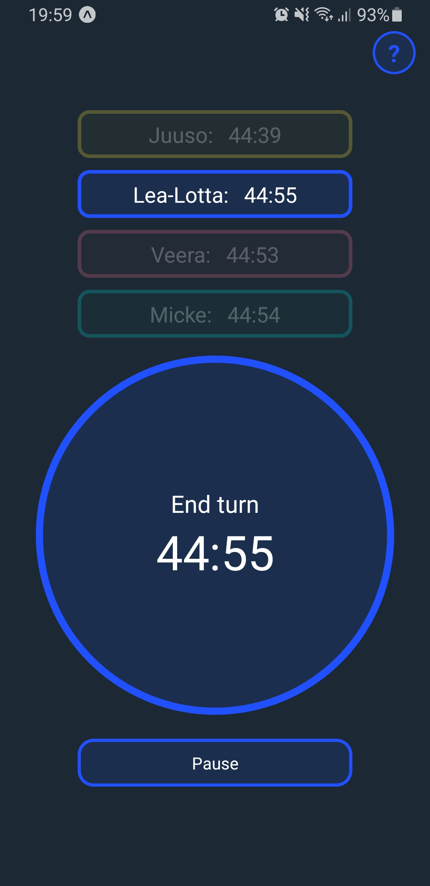

# Turn Timer

Turn timer is a timer for boardgames. Works like a chess clock, but with more than two players. Created as a practise project to learn React and React-native.

Useful for long games where a lot of the playing time is spent by players thinking their move. Turn timer limits the players' time to think, so games don't last forever.

## Screenshots

&nbsp;&nbsp;&nbsp;&nbsp;&nbsp;&nbsp;&nbsp;&nbsp;

## Possible future features

- Change player turn order
- Mercy time: if a player's time runs out, there's an option to give them more
- Increment option: add time on every turn
